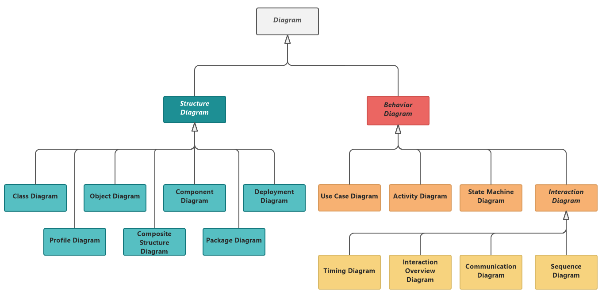
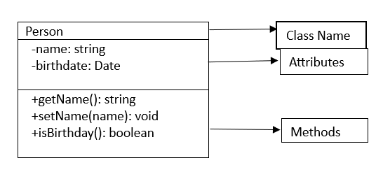
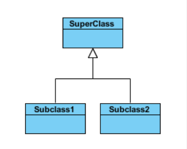
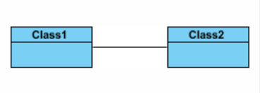
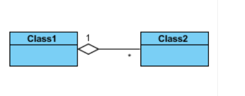
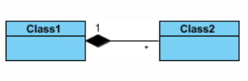
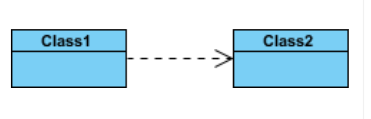
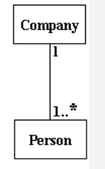

# Unified Modeling Language (UML)

Unified Modeling Language (UML) is a general purpose modelling language. It is used to visually represent the architecture, design, and implementation of complex software systems.

UML diagrams are used to portray the behavior and structure of a system.

## Types of UML diagrams
Diagrams in UML can be broadly classified as:

**Structural Diagrams:**  Captures static aspects or structure of a system. Structural Diagrams include: Component Diagrams, Object Diagrams, Class Diagrams and Deployment Diagrams.
**Behavior Diagrams:**  Captures dynamic aspects or behavior of the system. Behavior diagrams include: Use Case Diagrams, State Diagrams, Activity Diagrams and Interaction Diagrams.

Fig1 : Types of UML diagrams

## 1. Class diagram:
A class diagram in the Unified Modeling Language is a type of static structure diagram that describes the structure of a system by showing the system's classes, their attributes, operations, and the relationships among objects.

Fig2: Structure of a class in Class Diagram

**Visibility:**
Visibility defines whether attributes and operations of specific classes can be seen and used by other classes.

The +, -, # and ~ symbols before an attribute and operation name in a class denote the visibility of the attribute and operation.

- "+" denotes public attributes or operations
- "-" denotes private attributes or operations
- "#" denotes protected attributes or operations
- "~" denotes package attributes or operations

### Relationship between Classes:
---
Unified Modeling Language (UML) class diagrams allow us to depict the relationships between classes, representing how they interact and collaborate within a system. There are several types of relationships in UML class diagrams:

**1. Inheritance:** Inheritance is used to model the "is-a" relationship, where one class (the subclass or derived class) inherits attributes and behaviors from another class (the superclass or base class).
- Inhertance in the class diagram in uml is represented with closed arrow.
- Here the subclass1 and subclass2 inherits from superclass.

**2. Association:** An association represents a basic relationship between classes. It indicates that one class is related to another but doesn't specify the nature of the relationship. Associations can be one-to-one, one-to-many, or many-to-many.
- Association is represented with a straight line.
- Class1 and Class2 are asoosiated, but they can exists individually also.

**3. Aggregation:** Aggregation represents a "whole-part" relationship, each object has its own life cycle but there exists an ownership.
- Aggregation is represented with a empty diamond shape.
- here Class2 is associated with Class1 but Class2 can also exist individually.

**4. Composition:** Composition is a stronger form of aggregation, where the parts exist solely within the whole. If the whole is destroyed, its parts are also destroyed.
- Composition is represented with a filled diamond shape.
- here Class2 is associated with Class1 and if class1 is destoyed, Class2 will also be destoyed.

**5. Dependency:** Dependency represents a weak relationship between classes. It indicates that one class relies on another, typically in terms of method parameters or return types.
- Dependency is represented with an open arrow and dashed lines.

In UML class diagrams, these relationships are crucial for modeling and understanding the structure and interactions within a software system.
UML class diagrams can combine multiple relationship types to represent complex interactions within a system.

**7. Multiplicity:** Multiplicity specifies how many instances of one class are related to instances of another class.
- Multiplicity is represented as numbers or ranges near the association lines.
- here the image repesents that the company can have 1 to many employees(1..*) and employee belongs to onnly one company(1.)

### PlantUml:
---
[plantUml_Class_diagram](one-class.wsd)

Reference:
1. https://plantuml.com/class-diagram
2. https://plantuml.com/commons
